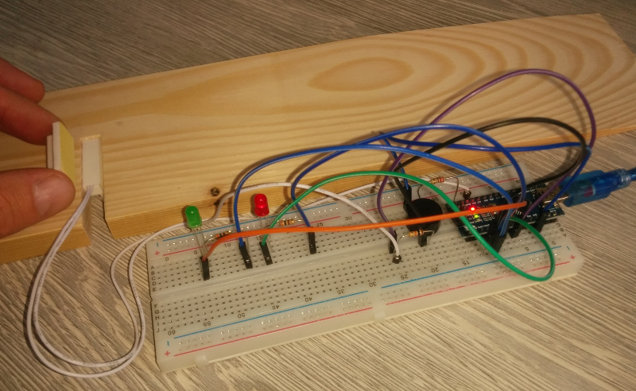
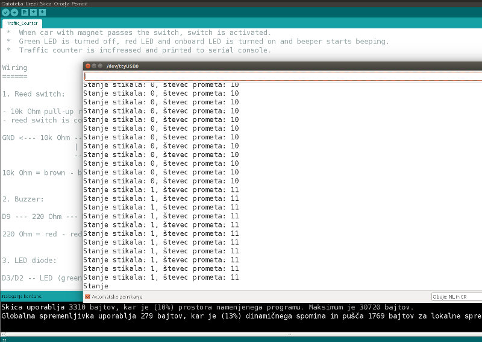
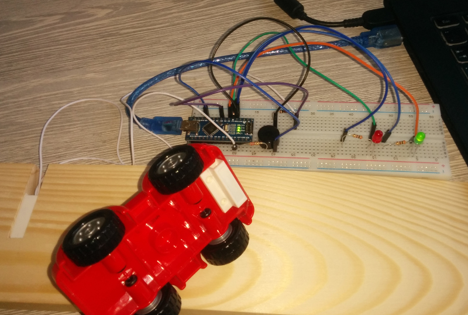
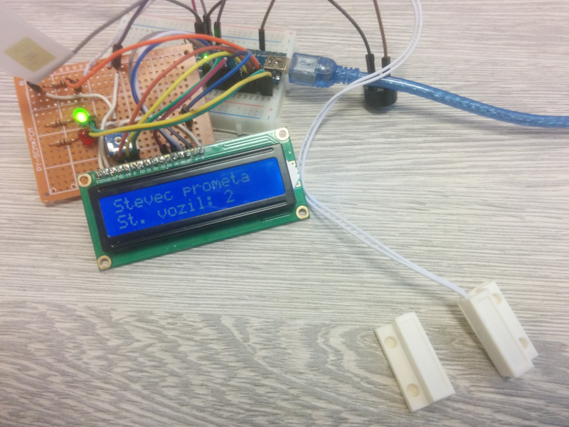

# Arduino traffic counter
Arduino traffic counter for CodeWeek workshop for children.

Arduino firmware for reading reed switch state and counting traffic.

## How does it work?

Magnet is mounted on a toy car. Reed switch is mounted inside the road. When car with magnet passes the switch, switch is activated. Green LED is turned off, red LED and onboard LED is turned on and beeper starts beeping. Traffic counter is increased and printed to serial console.

## Materials needed
1. 1 x Arduino Nano
2. 1 x reed switch (magnetic switch)
3. 1 x green LED diode
4. 1 x red LED diode
5. 1 x buzzer
6. 1 x 10k Ohm resistor
7. 1 x 220 Ohm resistor
8. 2 x 300 Ohm resistor

## Traffic counter with LCD screen
Available is also a version, which is displaying traffic counter on LCD screen. For this version you will additionally need:
1. 1 x LCD display (16x2)
2. 1 x 220 Ohm resistor
3. 1 x 10 kOhm potentiometer

